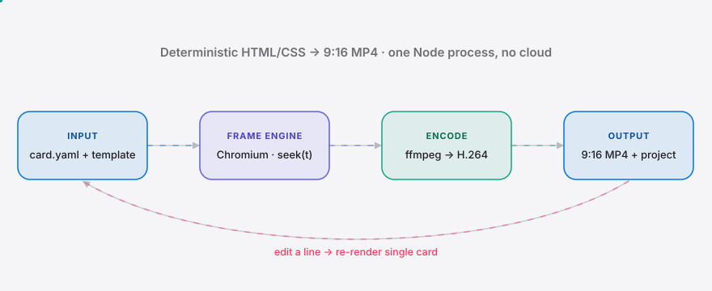

<div align="right"><sub><b>English</b>&nbsp;&nbsp;⇄&nbsp;&nbsp;<a href="./README.md">简体中文</a></sub></div>

<p align="center">
  <picture>
    <source media="(prefers-color-scheme: dark)" srcset="./assets/hero-dark.svg">
    <source media="(prefers-color-scheme: light)" srcset="./assets/hero-light.svg">
    
  </picture>
</p>

<p align="center"><sub>Render structured text into a 9:16 vertical kinetic knowledge-card MP4 — the output is an editable, reusable HTML/CSS template project, not a throwaway export.</sub></p>

<p align="center">
  <a href="./LICENSE"></a>
  <a href="https://github.com/SuperMarioYL/kinecard/releases"></a>
  <a href="https://github.com/SuperMarioYL/kinecard/actions/workflows/ci.yml"></a>
  
  
</p>

**Stop hand-keying subtitle motion frame by frame and shipping a black-box draft. KineCard renders your copy into a vertical kinetic card with one command — and the output is a diff-able HTML/CSS project you can edit and re-render a single card from.**

KineCard rides the **HTML → video** lane proven by [heygen-com/hyperframes](https://github.com/heygen-com/hyperframes) (34k★) and [calesthio/OpenMontage](https://github.com/calesthio/OpenMontage) (37k★) — but fills the gap they ignore: 9:16 vertical, subtitle safe-zones, platform duration rules, and a taste-curated Chinese kinetic template pack for knowledge creators. The core render is a **deterministic HTML/CSS → MP4** pipeline: the same input renders byte-identical video, with no model in the loop. That determinism is what makes a card a reusable *style lock* instead of a one-off export.

##  Architecture

<p align="center">
  <picture>
    <source media="(prefers-color-scheme: dark)" srcset="./assets/atlas-dark.svg">
    <source media="(prefers-color-scheme: light)" srcset="./assets/atlas-light.svg">
    
  </picture>
</p>

One Node process, two child processes, no server and no cloud. Every template exposes a single pure function, `window.KineCard.seek(tMs)`, that sets all visual state as a function of time only (no wall-clock CSS animation). The frame engine `seek(t)`s and screenshots frame by frame; ffmpeg encodes the PNG sequence to H.264. That contract is the technical basis for determinism and for a reusable style pack.

##  Install & Quickstart

Needs Node ≥ 20. ffmpeg is bundled via `@ffmpeg-installer/ffmpeg`, and a CJK webfont (a Noto Sans SC subset, OFL) ships in-repo — so 中文 renders **offline, with zero network**.

```bash
git clone https://github.com/SuperMarioYL/kinecard && cd kinecard
npm install && npx playwright install chromium && npm run build
node dist/cli.js render examples/card.yaml -t minimal -o out.mp4
```

30 seconds later `out.mp4` is a 1080×1920 vertical kinetic card: the title fades in, body lines animate in line by line, and everything sits inside the subtitle safe zone.

<details><summary>sample output</summary>

```text
template: minimal   preset: douyin   1080×1920 @ 30fps
  capturing frames… 100% (234/234)
encoding 234 frames → out.mp4

✓ out.mp4
  7.8s · 234 frames · 0 warning(s) · 13.5s
```
</details>

##  Usage

```bash
# 1) render a card with a built-in template
kinecard render examples/card.yaml -t spotlight -o out.mp4

# 2) also write an EDITABLE source project, then re-render after editing
kinecard render examples/card.yaml -t minimal --project my-card/
#   → my-card/{card.yaml, render.json, template/}   after editing:
kinecard render my-card/                 # single-card re-render, instant update

# 3) scaffold a project / list the built-in templates
kinecard init my-card/ -t mono
kinecard list
```

- **`render <card.yaml|project-dir>`** — `-t <template>`, `-o <out.mp4>`, `--project <dir>`, `--preset douyin|shipinhao|bilibili`, `--fps <n>`.
- **`--project`** materializes the template HTML/CSS/JS + `card.yaml` + `render.json` into a diff-able directory — this is KineCard's *format ownership*: the deliverable is a project, not a black-box draft.
- On any render, a line that overflows the **subtitle safe zone** or a total duration past the platform cap prints a ⚠ warning (non-blocking).
- More in [`examples/`](./examples). Three built-in templates: `minimal` (centered fade), `spotlight` (dark spotlight highlight), `mono` (monospace typewriter).

##  Demo


Render → vertical playback (title fade-in, line-by-line kinetic) → edit one line of `card.yaml` → re-render a single card. Fully offline, faceless, no voiceover.

##  Configuration (render.json)

`--project` writes a `render.json` into the project; edit it to change the render spec.

| Key | Type | Default | Meaning |
|---|---|---|---|
| `preset` | `douyin` \| `shipinhao` \| `bilibili` | `douyin` | Platform preset: canvas / fps / max duration / safe zone |
| `fps` | number | `30` | Frame rate |
| `size` | `[w, h]` | `[1080, 1920]` | Canvas size (9:16 vertical) |
| `timing` | object | see below | `titleMs` / `perLineMs` / `lineInMs` / `outroMs` (ms) |
| `safeZone` | object | per preset | `top` / `bottom` / `left` / `right` (fraction 0–0.5) |

`card.yaml` is the content: `title`, `lines:[{text, accent?}]`, optional `palette` and `platform`.

##  Pricing

The core CLI and the three base templates are **free and open source, forever**. Monetization sits at premium template packs + batch render, not GitHub Sponsors:

| Item | Price | What you get |
|---|---|---|
| OSS core + 3 base templates | **Free** | Everything in this repo |
| A premium template pack | **¥99–199** (one-off) | Magazine / Swiss / academic styles: palette + motion + safe-zone presets |
| Creator membership | **¥39 / month** | All packs + ongoing updates |
| MCN / course-team license | **¥299–599 / month** | Batch render + style lock + commercial license |

Sold via **爱发电 (afdian)** (one-off / membership) + a **知识星球** community; **Gumroad** for overseas/dev buyers. v0.1 ships only the free core to validate demand first.

##  Roadmap

- [x] **m1** — one command renders a deterministic 1080×1920 MP4, title fade-in + line-by-line body motion
- [x] **m2** — `--project` editable project + single-card re-render + 抖音/视频号 presets + safe-zone/duration linter + a 2nd template (`spotlight`)
- [x] a 3rd template (`mono`) + `init` scaffold + `list` gallery
- [ ] **m3** — multi-card consistency check (one style lock across a set) + auto sample gallery
- [ ] More paid template packs (magazine / Swiss / academic)
- [ ] Batch render: one style lock → a set of N cards
- [ ] Optional `--polish`: model-assisted copy polish (the render never depends on a model)
- [ ] Hosted render (a no-install path, no local Playwright/ffmpeg)

##  Compared

Honest positioning (each is stronger on its home turf):

| Capability | KineCard | hyperframes | OpenMontage | 剪映 图文成片 |
|---|:---:|:---:|:---:|:---:|
| HTML → video rendering | ✓ | ✓ | ✓ | — |
| 9:16 + safe zone + platform duration | ✓ | — | — | ✓ |
| Chinese kinetic template pack | ✓ | — | — | partial (not a set) |
| Diff-able / reusable source | ✓ | ✓ | ✓ | ✗ (black-box draft) |
| Built for creators, not developers | ✓ | ✗ (for agents) | ✗ (for agents) | ✓ |
| General / horizontal breadth | — | ✓ | ✓ | — |

##  License & Contributing

[MIT](./LICENSE). The bundled font is a Noto Sans SC subset under [SIL OFL 1.1](./assets/fonts/OFL.txt) (applies to the font files only). Issues and PRs welcome — a new template pack is one more way to give creators *format ownership*.

## Share this

```text
KineCard — HTML → video, but for the one output the dev-facing tools ignore:
a vertical knowledge card. One command; the deliverable is a diff-able, re-renderable
HTML/CSS project, not a black-box draft. https://github.com/SuperMarioYL/kinecard
```

<p align="center"><sub><a href="./LICENSE">MIT</a> © 2026 SuperMarioYL</sub></p>
