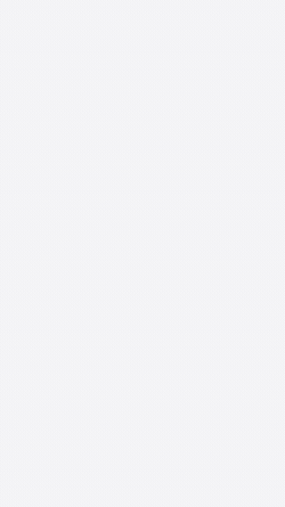

[简体中文](./README.md) · [Website](https://kinecard.lei6393.com) · [GitHub](https://github.com/SuperMarioYL/kinecard)

<picture>
  <source media="(max-width: 600px) and (prefers-color-scheme: dark)" srcset="./assets/presentation/hero-mobile-dark.svg">
  <source media="(max-width: 600px)" srcset="./assets/presentation/hero-mobile-light.svg">
  <source media="(prefers-color-scheme: dark)" srcset="./assets/presentation/hero-dark.svg">
  
</picture>

# kinecard

**Keep the editable project behind each motion card.**

KineCard turns a title and text lines into a timed card animation, keeping card.yaml, render.json and the HTML/CSS/JS template available for later edits.

## Why use it

A rendered video is difficult to revise without its source. A small project directory preserves the content, timing and template so one card can be changed and rendered again.

- **Keep editable content** — YAML and template sources remain available after export.
- **Address animation by time** — Templates expose a deterministic seek function.
- **Inspect layout warnings** — The linter reports estimated overflow before capture.

## Architecture

<picture>
  <source media="(max-width: 600px) and (prefers-color-scheme: dark)" srcset="./assets/presentation/architecture-mobile-dark.svg">
  <source media="(max-width: 600px)" srcset="./assets/presentation/architecture-mobile-light.svg">
  <source media="(prefers-color-scheme: dark)" srcset="./assets/presentation/architecture-dark.svg">
  
</picture>

The schema loader validates content and render settings. The linter estimates horizontal text overflow and duration against bundled presets. Playwright drives window.KineCard.seek(tMs) and captures frames; ffmpeg encodes those PNGs as H.264. Project export retains the editable source.

| Component | Responsibility |
| --- | --- |
| `Card + render config` | src/schema.ts |
| `Editable template` | src/project.ts; templates |
| `Timed frame capture` | src/frames.ts |
| `H.264 encoder` | src/encode.ts |

## Install and quickstart

Build with the version declared in the repository manifest. Run the example from the repository root.

```bash
git clone https://github.com/SuperMarioYL/kinecard.git
cd kinecard
npm ci
npm run build
npx playwright install chromium
```

The included script creates a complete one-card project, renders six small preview frames and saves docs/demo-preview.mp4. The configured animation timeline is 1400ms; six frames at 4fps produce a 1500ms video.

```bash
node examples/presentation-demo.cjs
```

## Recorded demo

<picture>
  <source media="(max-width: 600px) and (prefers-color-scheme: dark)" srcset="./assets/presentation/process-mobile-dark.svg">
  <source media="(max-width: 600px)" srcset="./assets/presentation/process-mobile-light.svg">
  <source media="(prefers-color-scheme: dark)" srcset="./assets/presentation/process-dark.svg">
  
</picture>

Chromium and ffmpeg produce a six-frame MP4 with no linter warning for this card.

```text
{
  "template": "minimal",
  "size": [
    360,
    640
  ],
  "fps": 4,
  "duration_ms": 1400,
  "frames": 6,
  "warnings": 0,
  "video_bytes": 7323
}
```

The complete command and output are recorded in [docs/demo-results.json](./docs/demo-results.json). Inputs and reproduction code are included in the repository.



The existing recording is retained for context; the text example above documents the reproducible scenario.

[Rendered MP4 preview](./docs/demo-preview.mp4)

## Usage

The CLI exposes the following operations. Commands after the example use your own paths or identifiers.

```bash
node dist/cli.js render examples/card.yaml -t minimal -o out.mp4
node dist/cli.js init my-card -t spotlight
node dist/cli.js render my-card
node dist/cli.js render examples/card.yaml --project editable-card
node dist/cli.js check my-set/                 # multi-card style-lock check
node dist/cli.js gallery examples/card.yaml -o my-gallery   # one card x every template
```

`check` runs the same safe-zone/duration lint the renderer uses on every card, then compares platform and palette across the set (plus timing and template sources between projects), naming exactly which input deviates and exiting non-zero on inconsistency. `gallery` reuses the full render pipeline to render the same copy once per built-in template and writes a gallery.html comparison page.

## Configuration

card.yaml owns title, optional subtitle, lines, palette and platform. render.json owns fps, size, title/per-line/outro timing and fractional safe zones. Templates expose seek(tMs). Built-in templates are minimal, spotlight and mono; font assets retain their separate OFL license.

## Integrations and responsibilities

<picture>
  <source media="(max-width: 600px) and (prefers-color-scheme: dark)" srcset="./assets/presentation/integrations-mobile-dark.svg">
  <source media="(max-width: 600px)" srcset="./assets/presentation/integrations-mobile-light.svg">
  <source media="(prefers-color-scheme: dark)" srcset="./assets/presentation/integrations-dark.svg">
  
</picture>

The following routes are implemented in the source. Choose the input that matches your task and keep the resulting artifact with your project.

| Route | Implemented role |
| --- | --- |
| card.yaml | Title, lines, palette and platform |
| HTML / CSS / JS | Editable template source |
| Playwright Chromium | Time-addressed screenshots |
| ffmpeg | PNG sequence to MP4 |
| Noto Sans SC subset | Bundled CJK font assets |

## Limits and next steps

- Rendering requires a compatible Playwright Chromium and ffmpeg. Installing dependencies or a browser may require network access.
- Deterministic seek timestamps do not guarantee byte-identical video across operating systems, browser versions or encoders.
- Safe-zone and duration checks use repository presets and estimated text widths, not a live platform specification or complete visual-layout validation.
- The short demo uses 360x640 at 4fps to keep reproduction small; normal presets can render 1080x1920 at higher frame rates.

Cross-card consistency checking (`kinecard check`) and the sample gallery (`kinecard gallery`) are available; batch rendering remains a future direction. Inspect generated frames in the target composition before publishing.

## License and contributions

Licensed under [Apache-2.0](./LICENSE); the bundled font is a Noto Sans SC subset under SIL OFL 1.1 (font files only). When reporting an issue, include a minimal input, the command, and the observed output.
