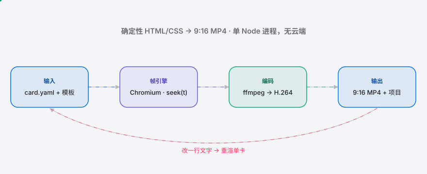

<div align="right"><sub><a href="./README.en.md">English</a>&nbsp;&nbsp;⇄&nbsp;&nbsp;<b>简体中文</b></sub></div>

<p align="center">
  <picture>
    <source media="(prefers-color-scheme: dark)" srcset="./assets/hero-cn-dark.svg">
    <source media="(prefers-color-scheme: light)" srcset="./assets/hero-cn-light.svg">
    
  </picture>
</p>

<p align="center"><sub>把一段结构化文案渲染成 9:16 <b>竖屏知识动效卡片</b>短视频——产物是可编辑、可复用的 HTML/CSS 模板项目，而非一次性 MP4。</sub></p>

<p align="center">
  <a href="./LICENSE"></a>
  <a href="https://github.com/SuperMarioYL/kinecard/releases"></a>
  <a href="https://github.com/SuperMarioYL/kinecard/actions/workflows/ci.yml"></a>
  
  
  
</p>

**剪映里逐帧手 K 字幕动效、产物还是黑盒草稿？KineCard 用一条命令把文案渲染成竖屏动效卡片，产物是能 diff、能改单卡重渲的 HTML/CSS 模板项目。**

沿用 [heygen-com/hyperframes](https://github.com/heygen-com/hyperframes)（34k★）与 [calesthio/OpenMontage](https://github.com/calesthio/OpenMontage)（37k★）验证过的 **HTML → video** 思路，但补上它们不吃的那一段：9:16 竖屏、字幕安全区、平台时长规范，以及一套面向中文知识创作者的成套 kinetic 模板库。核心渲染是 **确定性的 HTML/CSS → MP4**：同一份输入渲染出逐字节一致的视频，不依赖任何模型——这才是可复用「风格锁」而非一次性导出的前提。

##  架构

<p align="center">
  <picture>
    <source media="(prefers-color-scheme: dark)" srcset="./assets/atlas-cn-dark.svg">
    <source media="(prefers-color-scheme: light)" srcset="./assets/atlas-cn-light.svg">
    
  </picture>
</p>

一个 Node 进程，两个子进程，无服务器、无云端。每个模板只暴露一个纯函数 `window.KineCard.seek(tMs)`——它把所有画面状态写成「时间的纯函数」（没有 CSS 墙钟动画）。帧引擎逐帧 `seek(t)` + 截图，ffmpeg 把 PNG 序列编码成 H.264。这个契约就是「确定性」与「可复用风格包」的技术基础。

##  安装 & 快速开始

需要 Node ≥ 20。ffmpeg 由 `@ffmpeg-installer/ffmpeg` 自带，中文字体（Noto Sans SC 子集，OFL）随包内置——**离线、零网络**即可渲染中文。

```bash
git clone https://github.com/SuperMarioYL/kinecard && cd kinecard
npm install && npx playwright install chromium && npm run build
node dist/cli.js render examples/card.yaml -t minimal -o out.mp4
```

30 秒后 `out.mp4` 就是一条 1080×1920 的竖屏动效卡片：标题淡入、正文逐行 kinetic 上浮、字幕落在安全区内。

<details><summary>终端输出示例</summary>

```text
template: minimal   preset: douyin   1080×1920 @ 30fps
  capturing frames… 100% (234/234)
encoding 234 frames → out.mp4

✓ out.mp4
  7.8s · 234 frames · 0 warning(s) · 13.5s
```
</details>

##  用法

```bash
# 1) 用内置模板渲染一张卡片
kinecard render examples/card.yaml -t spotlight -o out.mp4

# 2) 同时写出一个「可编辑的源项目」，之后改文案重渲
kinecard render examples/card.yaml -t minimal --project my-card/
#   → my-card/{card.yaml, render.json, template/}   编辑后：
kinecard render my-card/                 # 单卡重渲，画面即时更新

# 3) 从零脚手架一个项目 / 查看内置模板
kinecard init my-card/ -t mono
kinecard list
```

- **`render <card.yaml|项目目录>`** — `-t <模板>`、`-o <out.mp4>`、`--project <目录>`、`--preset douyin|shipinhao|bilibili`、`--fps <n>`。
- **`--project`** 把模板 HTML/CSS/JS + `card.yaml` + `render.json` 落成一个可 diff 的目录——这是 KineCard 的「格式所有权」：产物是项目，不是黑盒草稿。
- 任意渲染时，若某行超出**字幕安全区**或总时长超过平台上限，会打印 ⚠ 警告（不阻断）。
- 更多示例见 [`examples/`](./examples)。三套内置模板：`minimal`（居中淡入）、`spotlight`（深色聚光高亮）、`mono`（等宽打字机）。

##  演示


渲染 → 竖屏播放（标题淡入、正文逐句 kinetic）→ 改一行 `card.yaml` → 单卡重渲，全程离线、无真人、无配音。

##  配置（render.json）

`--project` 会在项目里写出 `render.json`；编辑它即可改渲染规格。

| 键 | 类型 | 默认 | 含义 |
|---|---|---|---|
| `preset` | `douyin` \| `shipinhao` \| `bilibili` | `douyin` | 平台预设：画布 / 帧率 / 时长上限 / 字幕安全区 |
| `fps` | number | `30` | 帧率 |
| `size` | `[w, h]` | `[1080, 1920]` | 画布尺寸（9:16 竖屏） |
| `timing` | object | 见下 | `titleMs` / `perLineMs` / `lineInMs` / `outroMs`（毫秒） |
| `safeZone` | object | 随 preset | `top` / `bottom` / `left` / `right`（占比 0–0.5） |

`card.yaml` 则是内容：`title`、`lines:[{text, accent?}]`、可选 `palette` 与 `platform`。

##  定价

核心 CLI 与三套基础模板永远 **开源免费**。收费落在「成套模板包 + 批量渲染」，而不是 GitHub Sponsors：

| 项目 | 价格 | 内容 |
|---|---|---|
| 开源核心 + 3 基础模板 | **免费** | 本仓库全部功能 |
| 单个成套模板包 | **¥99–199**（一次性） | 杂志 / Swiss / 学术风等，含配色 + 动效 + 安全区预设 |
| 创作者会员 | **¥39 / 月** | 全部模板包 + 持续更新 |
| MCN / 课程团队版 | **¥299–599 / 月** | batch-render + 风格锁 + 商用授权 |

售卖走 **爱发电**（一次性 / 会员）+ **知识星球**（模板社区），海外/开发者走 **Gumroad**。v0.1 只发免费核心，先验证需求。

##  路线图

- [x] **m1** — 一条命令渲染确定性 1080×1920 MP4，标题淡入 + 正文逐行动效
- [x] **m2** — `--project` 可编辑项目 + 单卡重渲 + 抖音/视频号预设 + 字幕安全区/时长 linter + 第二套模板 `spotlight`
- [x] 第三套模板 `mono` + `init` 脚手架 + `list` 模板画廊
- [ ] **m3** — 多卡一致性检查（一套卡片风格锁）+ 自动样例 gallery
- [ ] 更多付费成套模板包（杂志 / Swiss / 学术风）
- [ ] 批量渲染：一次风格锁 → 一套 N 张卡片
- [ ] 可选 `--polish`：用模型润色文案（渲染仍不依赖模型）
- [ ] 托管渲染（免装 Playwright/ffmpeg 的一键路径）

##  对比

诚实定位（它们在各自主场都更强）：

| 能力 | KineCard | hyperframes | OpenMontage | 剪映 图文成片 |
|---|:---:|:---:|:---:|:---:|
| HTML → video 渲染 | ✓ | ✓ | ✓ | — |
| 9:16 + 字幕安全区 + 平台时长 | ✓ | — | — | ✓ |
| 中文成套 kinetic 模板库 | ✓ | — | — | 部分（不成套） |
| 产物可 diff / 可复用源 | ✓ | ✓ | ✓ | ✗（黑盒草稿） |
| 面向创作者、非开发者 | ✓ | ✗（面向 agent） | ✗（面向 agent） | ✓ |
| 通用/横向能力广度 | — | ✓ | ✓ | — |

##  许可 & 贡献

[MIT](./LICENSE)。内置字体为 Noto Sans SC 子集，遵循 [SIL OFL 1.1](./assets/fonts/OFL.txt)（仅适用于字体文件）。欢迎提 Issue / PR：新增一套模板，就是给知识创作者多一种「风格所有权」。

## Share this

```text
KineCard —— HTML → video，但做的是抖音/视频号的「竖屏知识动效卡片」。
一条命令渲染，产物是能 diff、能改单卡重渲的 HTML/CSS 模板项目，不是黑盒草稿。
https://github.com/SuperMarioYL/kinecard
```

<p align="center"><sub><a href="./LICENSE">MIT</a> © 2026 SuperMarioYL</sub></p>
